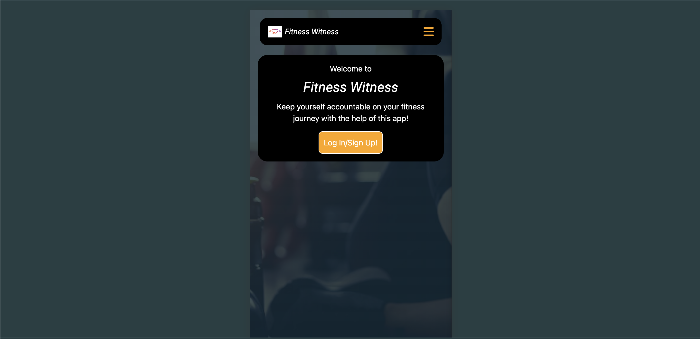
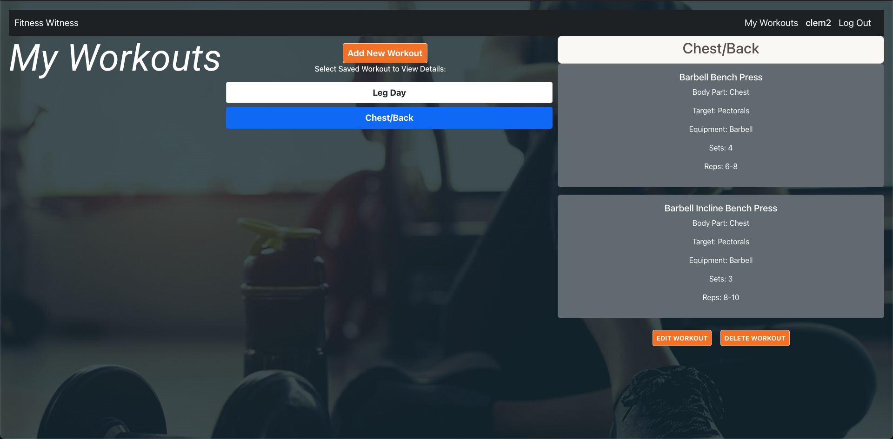
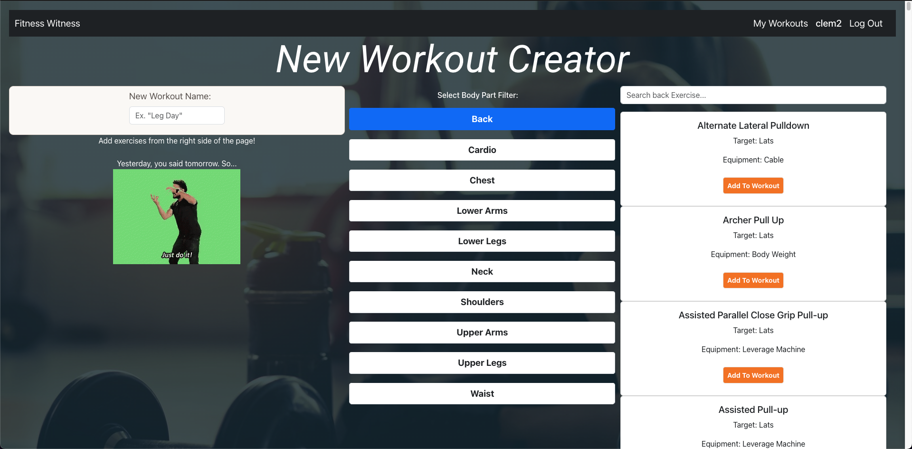

# 🏋️ Fitness Witness
#### [CLICK TO ACCESS THE APP](https://fitness-witness-633d35ffb601.herokuapp.com/) 
**Created by [Clem Alleyne](https://www.linkedin.com/in/clem-alleyne/)**

 
 
# 📝 Description

Fitness Witness is a MERN stack application you can use to create personalized workouts tailored to your unique fitness goals and save them for future reference. Say goodbye to generic workout plans and hello to a fully cusomized training experience!

Key Features:

Create Custom Workouts: Take control of your fitness journey by designing workouts that perfectly align with your goals, preferences, and fitness level. Customize exercises, sets, reps,, and more.

Exercise Library: Choose from a wide range of exercises to target specific muscle groups or achieve specific fitness objectives.

Save and Organize Workouts: Save your custom workouts for easy access and organization. Create multiple workout routines, categorize them by muscle group or training type, and effortlessly switch between different workouts based on your schedule or fitness focus.

# 📷 Screenshots

| Screenshot | Description |
|------------ | ------------|
| <h3 align="center">Home Page</h3> |   
| <h3 align="center">My Workouts Page</h3> |  
| <h3 align="center">New Workout Creator Page</h3> |  

# 👞 Next Steps

- Add custom workouts to a user's schedule, to keep track of what workouts they plan on doing on specific days
- Add more exercises to an existing workout
- Create custom exercises to add to a workout
- Keep track of user specific weights, speeds, etc. used for exercises
- Add more advanced overall app styling

[Trello Board](https://trello.com/b/S42jjRky/fitness-witness)